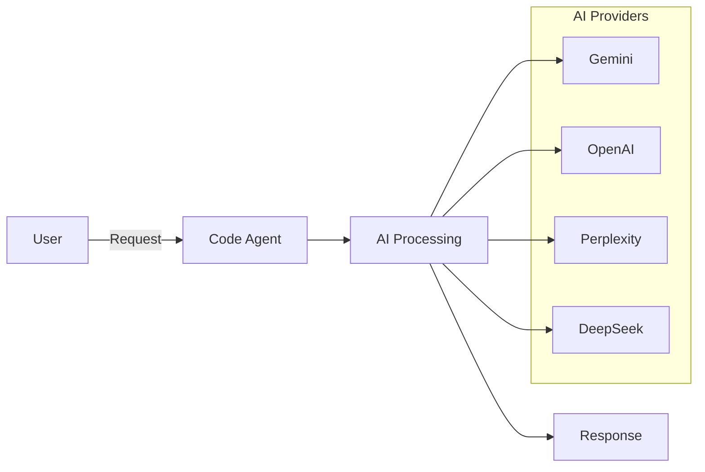
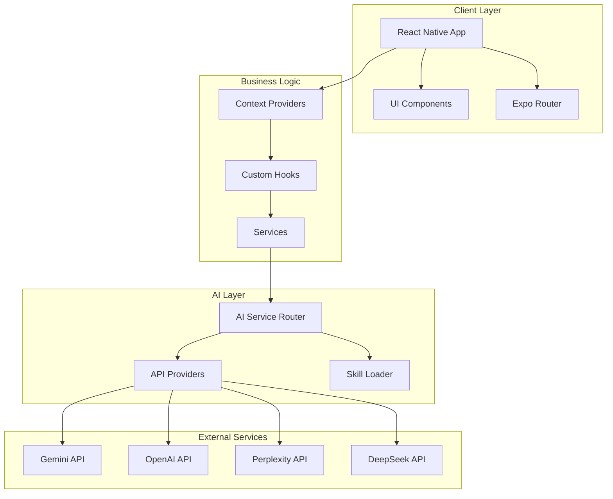
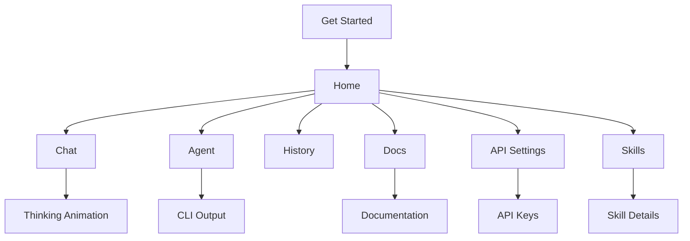
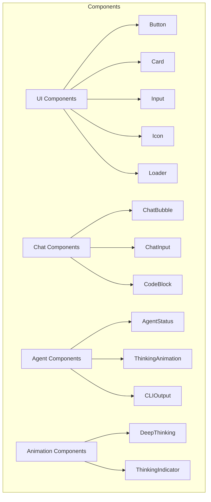
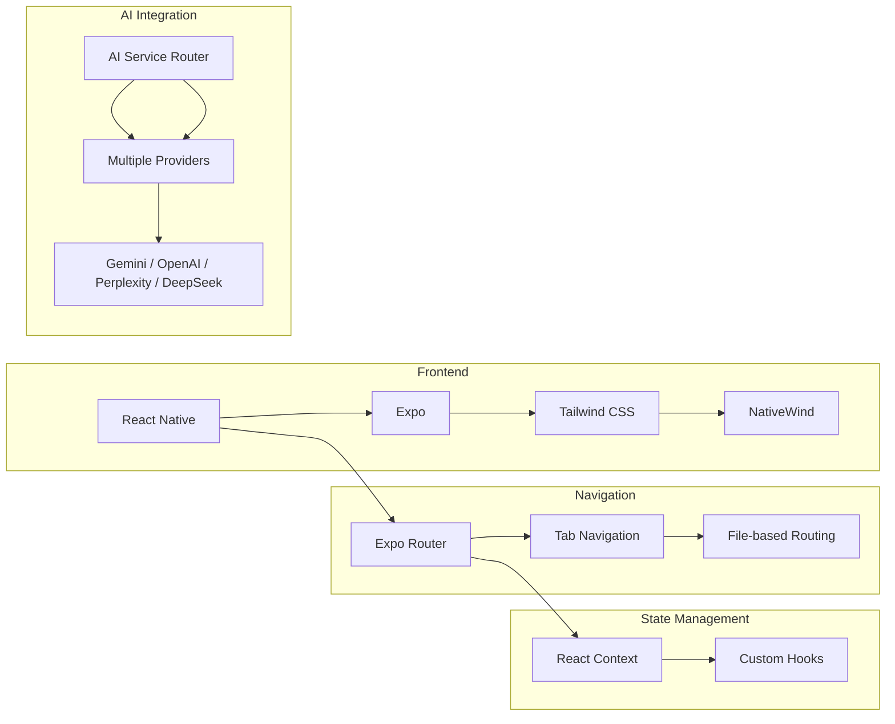
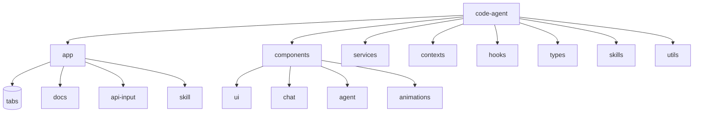
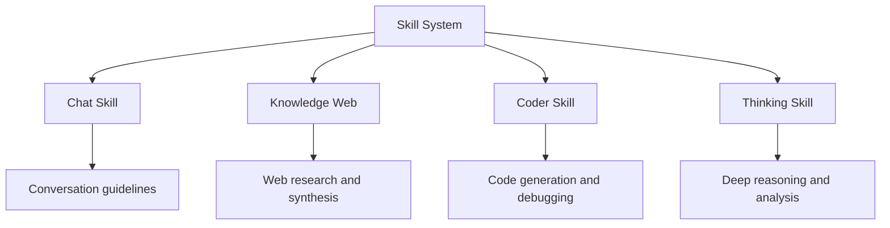
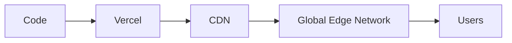

# 🤖 Code Agent

> AI-Powered Development Assistant for React Native (Expo)

[](https://github.com/amkyawdev/code-agent/stargazers)
[](LICENSE)
[](https://expo.io)
[](https://www.typescriptlang.org/)

**Your intelligent companion for faster, better code development**

[Features](#-features) • [Getting Started](#-getting-started) • [Architecture](#-architecture) • [Skills](#-skills) • [Deployment](#-deployment)

---

## 🎯 Overview

Code Agent is a powerful AI-powered development assistant built with React Native and Expo. It provides intelligent chat, code generation, and task automation capabilities with support for multiple AI providers.



## ✨ Features

| Feature | Description |
|---------|-------------|
| **AI Chat** | Natural conversation with multiple AI models |
| **Code Agent** | Execute complex coding tasks automatically |
| **History** | Searchable conversation history |
| **Skills** | Dynamic skill loading for specialized tasks |
| **Dark Theme** | Beautiful Minimax.io-style interface |
| **Fast** | Optimized for speed and responsiveness |

## 🏗 Architecture

### System Architecture



### Navigation Structure



### Component Hierarchy



## 🛠 Tech Stack



| Category | Technology |
|----------|------------|
| **Framework** | React Native + Expo |
| **Language** | TypeScript |
| **Navigation** | Expo Router |
| **Styling** | Tailwind CSS + NativeWind |
| **State** | React Context + Hooks |
| **AI Providers** | Gemini, OpenAI, Perplexity, DeepSeek |

## 🚀 Getting Started

### Prerequisites

- Node.js 18+
- npm or yarn
- Expo CLI (`npx expo`)
- Git

### Installation

```bash
# Clone the repository
git clone https://github.com/amkyawdev/code-agent.git
cd code-agent

# Install dependencies
npm install

# Start development
npx expo start
```

### Project Structure



```
code-agent/
├── app/                          # Expo Router pages
│   ├── (tabs)/                   # Tab navigation
│   │   ├── index.tsx             # Main / Loader
│   │   ├── chat.tsx              # Chat screen
│   │   ├── agent.tsx             # Agent screen
│   │   └── history.tsx           # History screen
│   ├── docs/                     # Documentation
│   ├── api-input/                # API configuration
│   ├── skill/[id].tsx            # Skill details
│   └── index.tsx                 # Get Started
│
├── components/                    # UI components
│   ├── ui/                       # Base components
│   ├── chat/                     # Chat components
│   ├── agent/                     # Agent components
│   └── animations/              # Animation components
│
├── services/                     # Business logic
│   ├── api/                      # AI API integrations
│   ├── agent/                    # Code agent services
│   └── storage/                  # Data persistence
│
├── contexts/                     # React contexts
├── hooks/                       # Custom hooks
├── types/                       # TypeScript types
├── skills/                       # Skill markdown files
│
├── tailwind.config.js           # Tailwind config
├── app.json                      # Expo config
├── vercel.json                   # Vercel hosting
└── package.json                 # Dependencies
```

## 📚 Skills

Code Agent uses dynamic skills for specialized tasks:



### Available Skills

| Skill | File | Purpose |
|-------|------|---------|
| **Chat** | `chat-skill.md` | Conversational AI guidelines |
| **Knowledge Web** | `knowledge-web.md` | Web research and info gathering |
| **Coder** | `coder-skill.md` | Programming assistance |
| **Thinking** | `thanking.md` | Deep reasoning and analysis |

### Skill Format (Anthropic-aligned)

```yaml
---
name: skill-name
description: "Use this skill when [trigger conditions]"
---

# Skill Title

## Overview
...

## Progressive Disclosure
### Level 1: Quick Answer
### Level 2: Standard Response  
### Level 3: Detailed Explanation
### Level 4: Deep Dive
```

## ☁️ Deployment

### Vercel (Recommended)

```bash
# Install Vercel CLI
npm i -g vercel

# Deploy
vercel

# Production deployment
vercel --prod
```

### Environment Variables

```env
# AI API Keys
GEMINI_API_KEY=your-gemini-key-type
OPENAI_API_KEY=your-openai-key-type
PERPLEXITY_API_KEY=your-perplexity-key-type
DEEPSEEK_API_KEY=your-deepseek-key-type
```



## 🤝 Contributing

Contributions are welcome! Please feel free to submit a Pull Request.

1. Fork the project
2. Create your feature branch (`git checkout -b feature/amazing`)
3. Commit your changes (`git commit -m 'Add amazing feature'`)
4. Push to the branch (`git push origin feature/amazing`)
5. Open a Pull Request

## 📄 License

This project is licensed under the MIT License - see the [LICENSE](LICENSE) file for details.

## 🙏 Acknowledgments

- [Expo](https://expo.io) - For the amazing development platform
- [Tailwind CSS](https://tailwindcss.com) - For styling system
- [Anthropic](https://anthropic.com) - For Claude AI
- [Google](https://deepmind.google/gemini) - For Gemini AI
- [OpenAI](https://openai.com) - For GPT models
- [Perplexity](https://perplexity.ai) - For web search AI
- [DeepSeek](https://deepseek.com) - For reasoning AI

---

**Built with by [AmkyawDev](https://github.com/amkyawdev)**

**Star this repo if you find it useful!**
